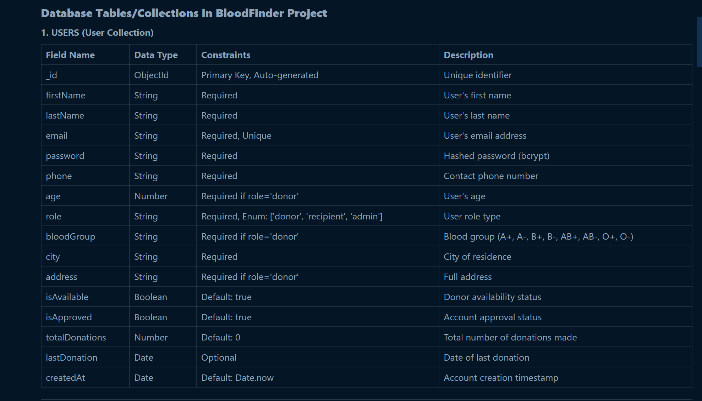
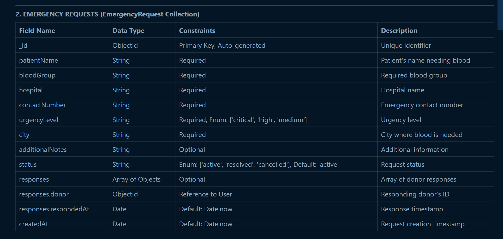
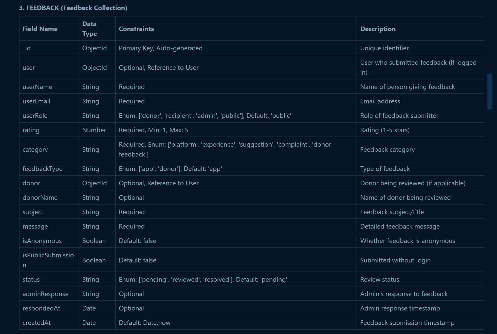
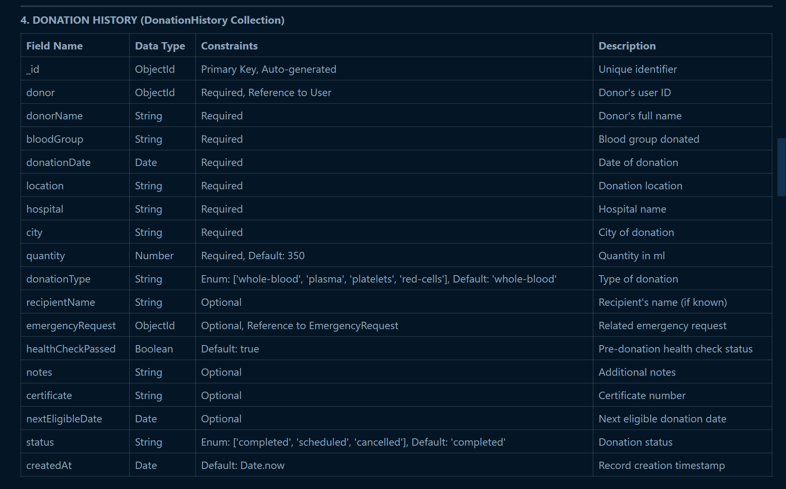
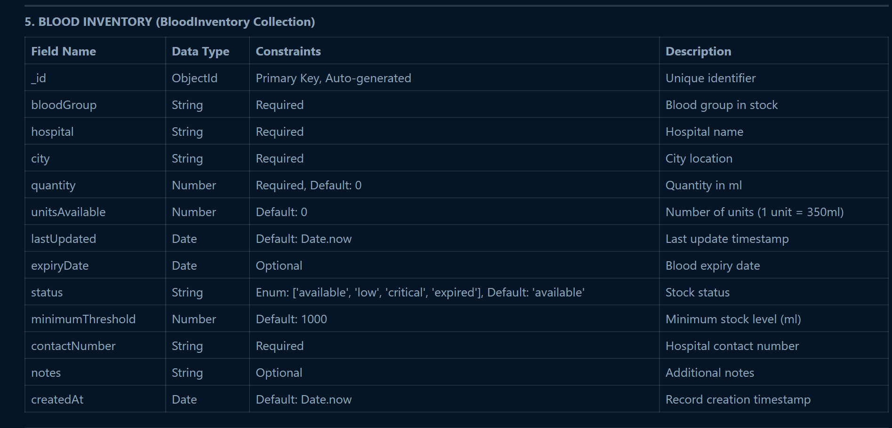
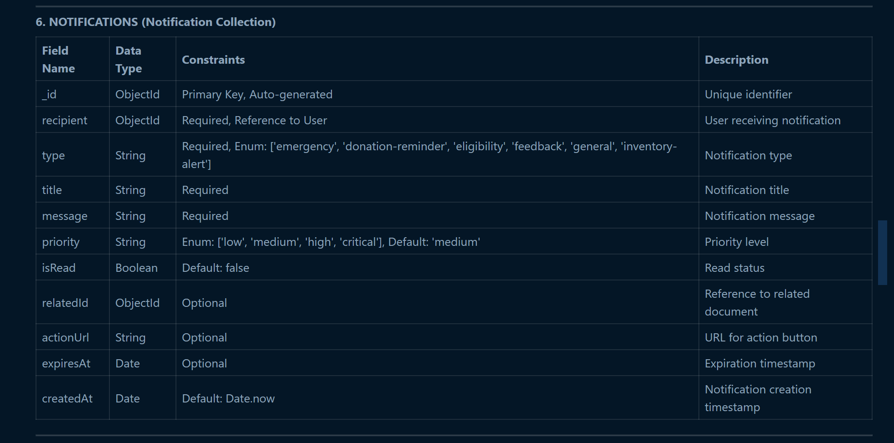
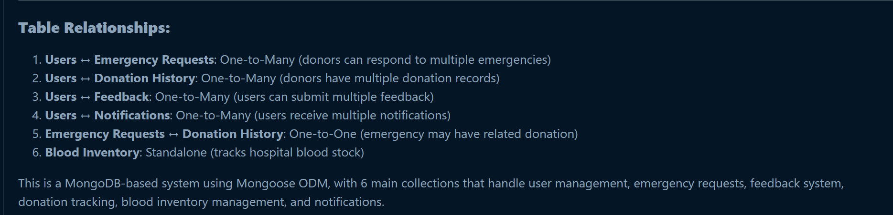

# 🩸 BloodFinder Database Schema Documentation

## 📋 Overview

BloodFinder uses **MongoDB** as its database with **6 main collections**. This document provides detailed specifications for each collection including field names, data types, constraints, and relationships.

---

## 📚 Table of Contents

1. [Users Collection](#1️⃣-users-collection)
2. [Emergency Requests Collection](#2️⃣-emergency-requests-collection)
3. [Feedback Collection](#3️⃣-feedback-collection)
4. [Donation History Collection](#4️⃣-donation-history-collection)
5. [Blood Inventory Collection](#5️⃣-blood-inventory-collection)
6. [Notifications Collection](#6️⃣-notifications-collection)
7. [Database Relationships](#-database-relationships)

---

## 1️⃣ USERS Collection

**Collection Name:** `users`  
**Description:** Stores all user accounts including donors, recipients, and administrators.

### Table Structure

### Indexes
- `email` (Unique)
- `role`, `city`, `bloodGroup` (Compound index for search optimization)

---

## 2️⃣ EMERGENCY REQUESTS Collection

**Collection Name:** `emergencyrequests`  
**Description:** Stores urgent blood requirement requests from hospitals and individuals.

### Table Structure

### Indexes
- `status`, `bloodGroup`, `city` (Compound index)
- `createdAt` (Descending)

---

## 3️⃣ FEEDBACK Collection

**Collection Name:** `feedbacks`  
**Description:** Stores user feedback about the platform and individual donors.

### Table Structure

### Indexes
- `status`, `category`
- `feedbackType`

---

## 4️⃣ DONATION HISTORY Collection

**Collection Name:** `donationhistories`  
**Description:** Records all blood donations made by donors.

### Table Structure

### Indexes
- `donor`
- `donationDate` (Descending)
- `bloodGroup`, `city`

### Business Rules
- ⏱️ **Whole blood donation:** Next eligible after **56 days**
- 💉 **Plasma donation:** Next eligible after **7 days**
- 🩸 **Platelet donation:** Next eligible after **7 days**

---

## 5️⃣ BLOOD INVENTORY Collection

**Collection Name:** `bloodinventories`  
**Description:** Tracks blood stock levels at various hospitals and blood banks.

### Table Structure

### Indexes
- `bloodGroup`, `hospital`, `city` (Compound index)
- `status`

### Status Calculation Rules
- 🔴 **Critical:** quantity < minimumThreshold × 0.3
- 🟡 **Low:** quantity < minimumThreshold
- 🟢 **Available:** quantity ≥ minimumThreshold
- ⚫ **Expired:** current date > expiryDate

---

## 6️⃣ NOTIFICATIONS Collection

**Collection Name:** `notifications`  
**Description:** Stores system notifications sent to users.

### Table Structure

### Indexes
- `recipient`, `isRead`
- `createdAt` (Descending)
- `expiresAt`

---

## 🔗 Database Relationships

### 📊 Relationship Diagram

### 🔗 Detailed Relationships

#### 1️⃣ Users ↔ Emergency Requests (One-to-Many)
- One user (donor) can respond to multiple emergency requests
- **Foreign Key:** `emergencyRequests.responses.donor` → `users._id`

#### 2️⃣ Users ↔ Donation History (One-to-Many)
- One donor can have multiple donation records
- **Foreign Key:** `donationHistory.donor` → `users._id`

#### 3️⃣ Users ↔ Feedback (One-to-Many)
- One user can submit multiple feedback entries
- **Foreign Keys:** 
  - `feedback.user` → `users._id` (feedback submitter)
  - `feedback.donor` → `users._id` (donor being reviewed)

#### 4️⃣ Users ↔ Notifications (One-to-Many)
- One user can receive multiple notifications
- **Foreign Key:** `notifications.recipient` → `users._id`

#### 5️⃣ Emergency Requests ↔ Donation History (One-to-One or One-to-Zero)
- One emergency request may result in one donation record
- **Foreign Key:** `donationHistory.emergencyRequest` → `emergencyRequests._id`

#### 6️⃣ Blood Inventory (Standalone)
- No direct foreign key relationships
- Used independently for tracking hospital blood stock

---

## 📝 Additional Notes

### 🔐 Authentication & Security
- Passwords are hashed using **bcrypt** with salt rounds of 10
- JWT tokens are used for authentication with 7-day expiration
- JWT Secret: Stored in environment variable `JWT_SECRET`

### ✅ Data Validation
- 📧 Email validation using regex pattern
- 📱 Phone number validation (Indian format: +91 followed by 10 digits)
- 🩸 Blood group validation against predefined values
- 🎂 Age validation: Minimum 18 years for donors

### ⚙️ Default Values
- 👤 Admin user created on server start:
  - **Email:** `admin@bloodfinder.com`
  - **Password:** `admin123`

### 💾 Database Configuration
- **Database Type:** MongoDB
- **ODM:** Mongoose
- **Default URI:** `mongodb://localhost:27017/bloodfinder`
- **Connection String:** Configurable via `MONGODB_URI` environment variable

### 🌱 Seeding Information
The database can be seeded with sample data including:
- 👥 40+ Indian donors from various cities
- 🚨 12+ emergency requests
- 💬 20+ feedback entries
- 📋 200+ donation history records
- 🏥 90+ inventory records (8 blood groups × 12 hospitals)
- 🔔 100+ notifications

---
 
**📅 Last Updated:** October 20, 2025

---

**Made with ❤️ By Benedict**
